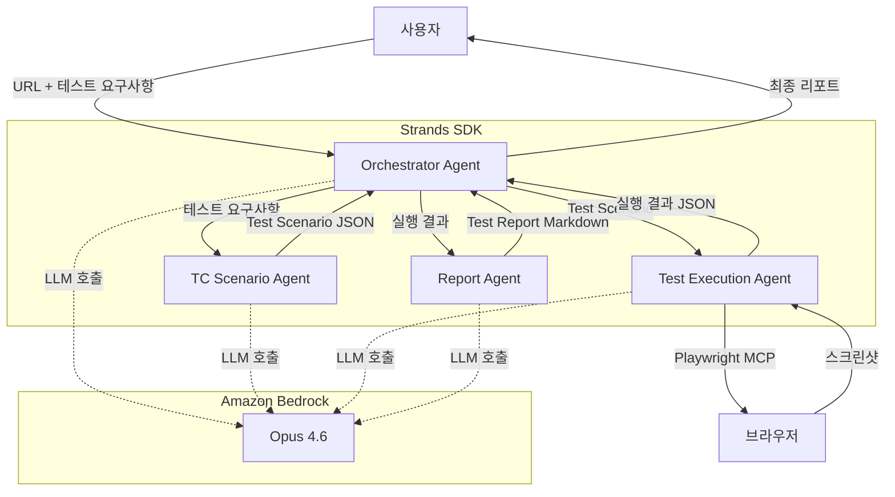
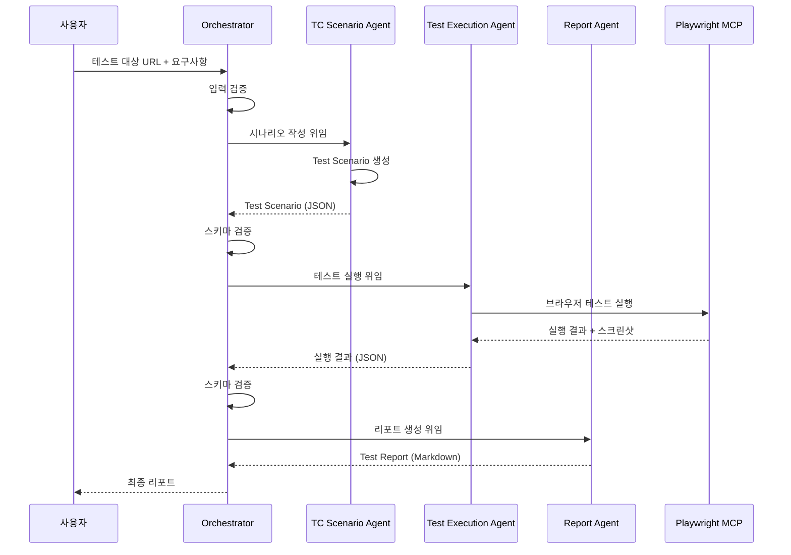
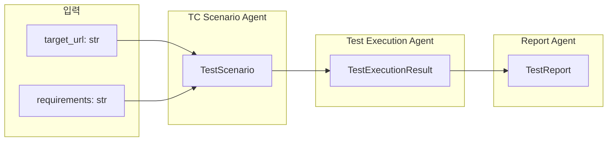
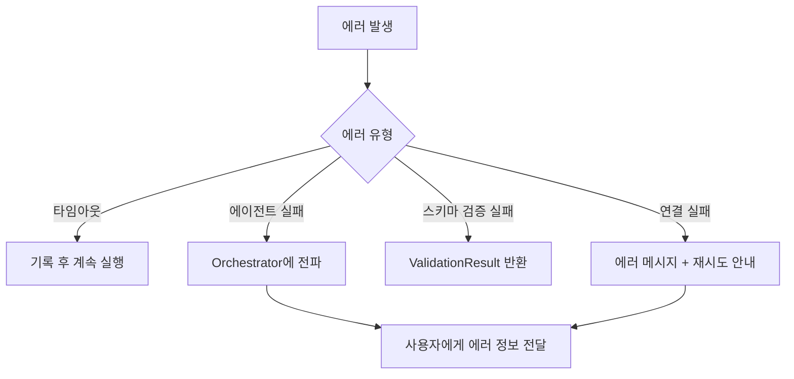

# 기술 설계 문서 (Technical Design Document)

## 개요 (Overview)

QA 에이전트 시스템은 Strands SDK 기반의 멀티 에이전트 QA 자동화 시스템입니다. 4개의 전문 에이전트가 파이프라인 형태로 협력하여, 테스트 시나리오 작성 → 브라우저 자동화 테스트 실행 → 리포트 생성의 전체 QA 프로세스를 자동화합니다.

핵심 기술 스택:
- **런타임(Runtime)**: Python 3.11+
- **에이전트 프레임워크(Agent Framework)**: Strands SDK
- **LLM 모델**: Amazon Bedrock Opus 4.6
- **브라우저 자동화(Browser Automation)**: Playwright MCP
- **데이터 직렬화(Serialization)**: JSON (Pydantic 모델 기반)

## 아키텍처 (Architecture)

시스템은 파이프라인 아키텍처를 따르며, 오케스트레이터 에이전트가 전체 흐름을 조율합니다.



### 에이전트 파이프라인 흐름



### 설계 결정 사항 (Design Decisions)

1. **파이프라인 패턴 선택**: 에이전트 간 순차적 데이터 흐름이 명확하므로, 복잡한 이벤트 기반 아키텍처 대신 단순한 파이프라인 패턴을 채택합니다.
2. **Pydantic 기반 데이터 모델**: 에이전트 간 JSON 통신의 스키마 검증을 Pydantic 모델로 처리하여, 타입 안전성(type safety)과 자동 직렬화/역직렬화를 확보합니다.
3. **에이전트별 독립 초기화**: 각 에이전트는 독립적으로 초기화되며, 하나의 에이전트 실패가 다른 에이전트에 영향을 주지 않습니다.
4. **Playwright MCP 통합**: Test Execution Agent만 Playwright MCP 도구를 사용하며, 다른 에이전트는 LLM 호출만 수행합니다.
5. **재시도 없음(No Retry) 정책**: Test Execution Agent는 테스트 실패, 타임아웃, 연결 실패 등 모든 실패 상황에서 자동 재시도를 수행하지 않습니다. 실패를 기록하고 즉시 다음 단계로 진행하거나 종료합니다.

## 컴포넌트 및 인터페이스 (Components and Interfaces)

### 1. QAAgentSystem (시스템 진입점)

시스템 전체를 초기화하고 실행하는 메인 클래스입니다.

```python
class QAAgentSystem:
    """QA 에이전트 시스템의 메인 진입점"""

    def __init__(self, model_id: str = "us.anthropic.claude-opus-4-0-20250514"):
        """시스템 초기화 - 4개 에이전트 생성"""
        ...

    def run(self, target_url: str, requirements: str) -> TestReport:
        """QA 프로세스 전체 실행"""
        ...
```

### 2. OrchestratorAgent (오케스트레이터 에이전트)

전체 QA 파이프라인의 흐름을 조율합니다.

```python
class OrchestratorAgent:
    """QA 프로세스 흐름 조율 에이전트"""

    def __init__(self, agent: Agent):
        ...

    def execute_pipeline(self, target_url: str, requirements: str) -> TestReport:
        """파이프라인 전체 실행"""
        ...

    def validate_data(self, data: BaseModel, schema_class: type) -> bool:
        """에이전트 간 전달 데이터 스키마 검증"""
        ...

    def get_agent_status(self, agent_name: str) -> AgentStatus:
        """에이전트 작업 상태 조회"""
        ...
```

### 3. TCScenarioAgent ( 시나리오 작성 에이전트)

```python
class TCScenarioAgent:
    """테스트 케이스 시나리오 작성 에이전트"""

    def __init__(self, agent: Agent):
        ...

    def generate_scenario(self, target_url: str, requirements: str) -> TestScenario:
        """테스트 시나리오 생성"""
        ...
```

### 4. TestExecutionAgent (테스트 실행 에이전트)

```python
class TestExecutionAgent:
    """Playwright MCP 기반 테스트 실행 에이전트"""

    def __init__(self, agent: Agent):
        ...

    def execute_tests(self, scenario: TestScenario) -> TestExecutionResult:
        """테스트 시나리오 실행"""
        ...

    def capture_screenshot(self, test_case_id: str) -> str:
        """스크린샷 캡처 및 저장 경로 반환"""
        ...
```

### 5. ReportAgent (리포트 생성 에이전트)

```python
class ReportAgent:
    """테스트 결과 리포트 생성 에이전트"""

    def __init__(self, agent: Agent):
        ...

    def generate_report(self, execution_result: TestExecutionResult) -> TestReport:
        """테스트 리포트 생성"""
        ...

    def format_markdown(self, report: TestReport) -> str:
        """리포트를 Markdown 형식으로 포맷팅"""
        ...
```

### 6. DataValidator (데이터 검증기)

```python
class DataValidator:
    """에이전트 간 데이터 스키마 검증"""

    @staticmethod
    def validate(data: dict, schema_class: type[BaseModel]) -> ValidationResult:
        """JSON 데이터를 Pydantic 스키마로 검증"""
        ...
```


## 데이터 모델 (Data Models)

에이전트 간 통신에 사용되는 핵심 데이터 모델입니다. 모든 모델은 Pydantic BaseModel을 상속하여 자동 JSON 직렬화/역직렬화 및 스키마 검증을 지원합니다.

### 에이전트 상태 (Agent Status)

```python
from enum import Enum
from pydantic import BaseModel, Field
from typing import Optional
from datetime import datetime

class AgentStatusEnum(str, Enum):
    """에이전트 작업 상태"""
    IDLE = "idle"           # 대기
    RUNNING = "running"     # 진행 중
    COMPLETED = "completed" # 완료
    FAILED = "failed"       # 실패

class AgentStatus(BaseModel):
    """에이전트 상태 정보"""
    agent_name: str
    status: AgentStatusEnum
    started_at: Optional[datetime] = None
    completed_at: Optional[datetime] = None
    error_message: Optional[str] = None
```

### 테스트 케이스 (Test Case)

```python
class TestStep(BaseModel):
    """테스트 단계"""
    step_number: int
    action: str          # Playwright MCP 실행 가능한 액션 기술
    expected_result: str

class TestCase(BaseModel):
    """테스트 케이스"""
    id: str                          # 고유 식별자 (예: "TC-001")
    name: str                        # 테스트 이름
    preconditions: list[str]         # 사전 조건
    steps: list[TestStep]            # 테스트 단계
    expected_result: str             # 기대 결과
    scenario_type: str               # "positive" 또는 "negative"
```

### 테스트 시나리오 (Test Scenario)

```python
class TestScenario(BaseModel):
    """테스트 시나리오 - TC Scenario Agent의 출력"""
    target_url: str
    requirements: str
    test_cases: list[TestCase]
    created_at: datetime
```

### 테스트 실행 결과 (Test Execution Result)

```python
class TestCaseResult(BaseModel):
    """개별 테스트 케이스 실행 결과"""
    test_case_id: str
    test_name: str
    passed: bool
    execution_time_ms: float
    screenshot_path: Optional[str] = None
    actual_result: Optional[str] = None
    expected_result: Optional[str] = None
    failure_reason: Optional[str] = None
    timed_out: bool = False

class TestExecutionResult(BaseModel):
    """전체 테스트 실행 결과 - Test Execution Agent의 출력"""
    scenario_id: str
    target_url: str
    results: list[TestCaseResult]
    total_execution_time_ms: float
    executed_at: datetime
```

### 테스트 리포트 (Test Report)

```python
class TestSummary(BaseModel):
    """테스트 요약"""
    total_tests: int
    passed_tests: int
    failed_tests: int
    success_rate: float  # 0.0 ~ 1.0

class TestReport(BaseModel):
    """테스트 리포트 - Report Agent의 출력"""
    title: str
    summary: TestSummary
    detailed_results: list[TestCaseResult]
    failed_screenshots: list[str]
    generated_at: datetime
    markdown_content: str
```

### 검증 결과 (Validation Result)

```python
class ValidationResult(BaseModel):
    """데이터 스키마 검증 결과"""
    is_valid: bool
    errors: list[str] = Field(default_factory=list)
```

### 데이터 흐름 다이어그램




## 정확성 속성 (Correctness Properties)

*속성(Property)은 시스템의 모든 유효한 실행에서 참이어야 하는 특성 또는 동작입니다. 속성은 사람이 읽을 수 있는 명세와 기계가 검증할 수 있는 정확성 보장 사이의 다리 역할을 합니다.*

### Property 1: 데이터 모델 JSON 라운드트립 (Data Model JSON Round-Trip)

*임의의* 유효한 데이터 모델(TestScenario, TestExecutionResult, TestReport, TestCase, TestCaseResult)에 대해, JSON으로 직렬화(serialize)한 후 역직렬화(deserialize)하면 원본과 동일한 객체를 복원해야 한다.

**Validates: Requirements 3.5, 4.8, 6.4**

### Property 2: 리포트 Markdown 라운드트립 (Report Markdown Round-Trip)

*임의의* 유효한 TestReport에 대해, Markdown으로 포맷팅한 후 다시 파싱하면 원본과 동일한 리포트 데이터(제목, 요약 통계, 상세 결과)를 복원해야 한다.

**Validates: Requirements 5.6**

### Property 3: 테스트 요약 통계 정확성 (Test Summary Statistics Accuracy)

*임의의* TestExecutionResult에 대해, 생성된 TestReport의 요약(TestSummary)은 다음을 만족해야 한다: total_tests == passed_tests + failed_tests, success_rate == passed_tests / total_tests, 그리고 total_tests는 입력 결과의 테스트 케이스 수와 동일해야 한다.

**Validates: Requirements 5.2, 5.3**

### Property 4: 실패 스크린샷 참조 완전성 (Failed Screenshot Reference Completeness)

*임의의* TestExecutionResult에 대해, 생성된 TestReport의 failed_screenshots 목록은 실패한(passed == false) 모든 TestCaseResult의 screenshot_path를 포함해야 한다.

**Validates: Requirements 5.4**

### Property 5: 에이전트 상태 전이 순서 (Agent Status Transition Order)

*임의의* 에이전트 실행 시퀀스에 대해, 에이전트 상태는 반드시 IDLE → RUNNING → COMPLETED 또는 IDLE → RUNNING → FAILED 순서로만 전이되어야 한다.

**Validates: Requirements 2.5**

### Property 6: 파이프라인 실행 순서 (Pipeline Execution Order)

*임의의* QA 파이프라인 실행에 대해, 오케스트레이터는 반드시 TC_Scenario_Agent → Test_Execution_Agent → Report_Agent 순서로 에이전트를 호출해야 하며, 이전 에이전트의 출력이 다음 에이전트의 입력으로 전달되어야 한다.

**Validates: Requirements 2.1, 2.2, 2.3, 2.4**

### Property 7: 스키마 검증 정확성 (Schema Validation Correctness)

*임의의* JSON 데이터에 대해, 유효한 데이터는 스키마 검증을 통과하고, 필수 필드가 누락되거나 타입이 잘못된 데이터는 검증에 실패해야 한다. 검증 실패 시 ValidationResult의 errors에 실패 항목과 원인이 포함되어야 한다.

**Validates: Requirements 6.2, 6.3, 2.7**

### Property 8: 에러 응답 필수 정보 포함 (Error Response Required Information)

*임의의* 에이전트 실패 시나리오에 대해, 에러 응답에는 반드시 실패한 에이전트 이름과 오류 원인이 포함되어야 한다. 오케스트레이터의 에러 전달 시에는 추가로 실패 단계 정보가 포함되어야 한다.

**Validates: Requirements 1.4, 2.6**

### Property 9: 테스트 시나리오 양면성 (Test Scenario Dual Coverage)

*임의의* 생성된 TestScenario에 대해, test_cases 목록에는 scenario_type이 "positive"인 테스트 케이스와 "negative"인 테스트 케이스가 각각 최소 1개 이상 포함되어야 한다.

**Validates: Requirements 3.3**

### Property 10: 데이터 모델 필수 필드 비공백 (Data Model Required Fields Non-Empty)

*임의의* TestCase에 대해 id, name, steps, expected_result가 비어있지 않아야 하며, *임의의* TestCaseResult에 대해 test_case_id, test_name이 비어있지 않아야 한다. 시스템 프롬프트는 각 에이전트마다 비어있지 않고 고유해야 한다.

**Validates: Requirements 3.2, 4.2, 1.3**

### Property 11: 타임아웃 시 계속 실행 (Continue Execution on Timeout)

*임의의* TestScenario에서 일부 TestCase가 타임아웃되더라도, TestExecutionResult의 results 목록 길이는 입력 TestScenario의 test_cases 목록 길이와 동일해야 하며, 타임아웃된 케이스는 timed_out == true로 표시되어야 한다.

**Validates: Requirements 4.6**

### Property 12: 실패 테스트 차이 기록 (Failed Test Difference Recording)

*임의의* 실패한(passed == false이고 timed_out == false인) TestCaseResult에 대해, failure_reason이 비어있지 않아야 하며, actual_result와 expected_result가 모두 기록되어 있어야 한다.

**Validates: Requirements 4.3**

## 에러 처리 (Error Handling)

### 에러 분류

| 에러 유형 | 발생 위치 | 처리 방식 |
|-----------|-----------|-----------|
| 에이전트 초기화 실패 | QAAgentSystem.__init__ | 실패한 에이전트 이름 + 원인 포함 에러 반환 |
| Bedrock 모델 연결 실패 | 각 에이전트 초기화 | 연결 실패 원인 + 재시도 안내 반환 |
| 스키마 검증 실패 | OrchestratorAgent.validate_data | 검증 실패 항목 + 원인 포함 ValidationResult 반환 |
| Playwright MCP 연결 실패 | TestExecutionAgent | 연결 실패 원인 포함 에러를 Orchestrator에 반환, 재시도 없이 즉시 종료 |
| 테스트 케이스 타임아웃 | TestExecutionAgent | timed_out=true 기록 후 재시도 없이 다음 테스트 계속 실행 |
| 테스트 케이스 실행 실패 | TestExecutionAgent | 실패 기록 후 재시도 없이 다음 테스트 계속 실행 |
| 하위 에이전트 작업 실패 | OrchestratorAgent | 에이전트 이름, 실패 단계, 오류 내용 포함 에러 전달 |
| 빈 실행 결과 | ReportAgent | "실행 결과 없음" 명시 리포트 생성 |

### 에러 전파 전략



- 타임아웃은 개별 테스트 케이스 수준에서 처리하고, 재시도 없이 나머지 테스트는 계속 실행합니다.
- 테스트 케이스 실패 시 재시도(retry) 없이 실패를 기록하고 다음 테스트로 진행합니다.
- Playwright MCP 연결 실패 시 재시도 없이 즉시 종료하고 에러를 오케스트레이터에 전파합니다.
- 에이전트 수준 실패는 오케스트레이터를 통해 사용자에게 전파합니다.
- 스키마 검증 실패는 파이프라인을 중단하고 상세 에러 정보를 반환합니다.

## 테스트 전략 (Testing Strategy)

### 이중 테스트 접근법 (Dual Testing Approach)

본 시스템은 단위 테스트(Unit Test)와 속성 기반 테스트(Property-Based Test)를 병행하여 포괄적인 테스트 커버리지를 확보합니다.

### 속성 기반 테스트 (Property-Based Testing)

- **라이브러리**: [Hypothesis](https://hypothesis.readthedocs.io/) (Python PBT 라이브러리)
- **최소 반복 횟수**: 각 속성 테스트당 100회 이상
- **태그 형식**: `# Feature: qa-agent-system, Property {번호}: {속성 설명}`
- **각 정확성 속성(Property)은 반드시 하나의 속성 기반 테스트로 구현해야 합니다**

#### 속성 테스트 대상

| 속성 번호 | 테스트 설명 | 생성기(Generator) |
|-----------|------------|-------------------|
| Property 1 | 데이터 모델 JSON 라운드트립 | 임의의 TestScenario, TestExecutionResult, TestReport 생성 |
| Property 2 | 리포트 Markdown 라운드트립 | 임의의 TestReport 생성 |
| Property 3 | 테스트 요약 통계 정확성 | 임의의 TestCaseResult 리스트 생성 |
| Property 4 | 실패 스크린샷 참조 완전성 | 성공/실패 혼합 TestCaseResult 리스트 생성 |
| Property 5 | 에이전트 상태 전이 순서 | 임의의 상태 전이 시퀀스 생성 |
| Property 6 | 파이프라인 실행 순서 | 모킹된 에이전트로 파이프라인 실행 |
| Property 7 | 스키마 검증 정확성 | 유효/무효 JSON 데이터 생성 |
| Property 8 | 에러 응답 필수 정보 포함 | 임의의 에이전트 실패 시나리오 생성 |
| Property 9 | 테스트 시나리오 양면성 | 임의의 TestScenario 생성 |
| Property 10 | 데이터 모델 필수 필드 비공백 | 임의의 TestCase, TestCaseResult 생성 |
| Property 11 | 타임아웃 시 계속 실행 | 타임아웃 포함 TestScenario 생성 |
| Property 12 | 실패 테스트 차이 기록 | 실패 TestCaseResult 생성 |

### 단위 테스트 (Unit Testing)

- **프레임워크**: pytest
- **모킹**: unittest.mock (Strands SDK, Bedrock API, Playwright MCP 모킹)

#### 단위 테스트 대상

- 시스템 초기화 시 4개 에이전트 생성 확인 (요구사항 1.1, 1.2)
- Bedrock 모델 연결 실패 시 에러 메시지 및 재시도 안내 확인 (요구사항 1.5)
- Playwright MCP 연결 실패 시 에러 메시지 확인 (요구사항 4.5)
- 스크린샷 캡처 및 저장 경로 확인 (요구사항 4.4)
- 빈 실행 결과에 대한 리포트 생성 확인 (요구사항 5.7)

### 테스트 구조

```
tests/
├── unit/
│   ├── test_agent_init.py          # 에이전트 초기화 단위 테스트
│   ├── test_error_handling.py      # 에러 처리 단위 테스트
│   └── test_screenshot.py          # 스크린샷 관련 단위 테스트
├── property/
│   ├── test_roundtrip.py           # Property 1, 2: 라운드트립 속성 테스트
│   ├── test_report_stats.py        # Property 3, 4: 리포트 통계 속성 테스트
│   ├── test_pipeline.py            # Property 5, 6: 파이프라인 속성 테스트
│   ├── test_validation.py          # Property 7, 8: 검증 속성 테스트
│   ├── test_scenario.py            # Property 9, 10: 시나리오 속성 테스트
│   └── test_execution.py           # Property 11, 12: 실행 속성 테스트
└── conftest.py                     # 공통 픽스처 및 Hypothesis 전략(Strategy)
```
